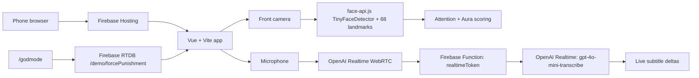

# FocusMaxxer

FocusMaxxer is a satirical lecture-focus web app. Audience members open a Firebase-hosted web page, tap **Enter Focus Mode**, grant camera/microphone access, and get a full-screen Subway Surfers feed with live OpenAI subtitles. A local face-tracking loop grades their attention as an Aura score. If their attention drops, the app plays a full-screen punishment video, vibrates where supported, and can show a short mugshot popup with a clown/rizz overlay.

The code lives in the old `faceRot` project directory, but the shipped product is FocusMaxxer.

## Live Routes

- Viewer: `https://facerot.web.app/`
- Admin remote: `https://facerot.web.app/godmode?pin=face-rot`

The admin remote writes a Firebase Realtime Database boolean that forces punishment on every connected viewer.

## Architecture



## Frontend

Stack:

- Vue 3 single-file app: `src/App.vue`
- Vite build: `npm run build`
- CSS: `src/styles.css`
- Firebase client sync: `src/sync.js`
- Static media/model assets in `public/`

The viewer flow:

1. User taps **Enter Focus Mode**.
2. Browser requests:
   - front camera: `facingMode: user`
   - microphone: `audio: true`
3. Subway video plays full-screen.
4. Hidden 1px camera video feeds face-api.
5. Mic audio streams to OpenAI Realtime over WebRTC.
6. Transcription events update the TikTok-style caption text.
7. Attention score updates Aura and punishment state.

## Attention Tracking

The app loads local model weights from:

```txt
public/models/tiny_face_detector_model-*
public/models/face_landmark_68_tiny_model-*
```

The detection loop runs every `400ms` with:

```js
faceapi
  .detectSingleFace(video, new faceapi.TinyFaceDetectorOptions(...))
  .withFaceLandmarks(true)
```

The attention score penalizes:

- no face
- weak face confidence
- face too far away
- head turned left/right
- looking down/up-ish via nose/chin/eye geometry
- eyes closed via eye aspect ratio

Bad attention must persist briefly before punishment starts, and good attention must persist briefly before punishment releases. This avoids flicker from a single missed frame.

## Aura System

Aura starts positive and changes continuously:

- good attention: Aura slowly increases
- bad attention or godmode punishment: Aura drains quickly

Ranks:

- `100+`: Ultimate Sigma
- `50-99`: Chief Rizz Officer
- `0-49`: Locked-In Scholar
- `-1 to -49`: Beta Status
- `<= -50`: Level 1 Crook

Every rank change shows a 1.5 second mugshot popup. It snapshots the hidden webcam video into a canvas and paints either a clown-style overlay for negative ranks or a rizz-restored overlay for positive ranks.

Rank changes also play local audio:

- rank up: `public/audio/rank-up.mp3`
- rank down: `public/audio/rank-down.mp3`

## Subtitles

Subtitles use OpenAI Realtime transcription with:

```txt
gpt-4o-mini-transcribe
```

The browser never receives the real OpenAI API key. Instead:

1. Vue calls `/api/realtime-token`.
2. Firebase Hosting rewrites that path to the Singapore Firebase Function.
3. The function uses `OPENAI_API_KEY` from its environment.
4. The function returns a short-lived Realtime client secret.
5. The browser uses that client secret to create a WebRTC session with OpenAI.
6. Transcript deltas update the caption overlay.

Relevant files:

- Function: `functions/index.js`
- Hosting rewrite: `firebase.json`
- Browser WebRTC logic: `src/App.vue`

## Firebase

Services used:

- Firebase Hosting
- Firebase Realtime Database
- Firebase Functions Gen 2

Function region:

```txt
asia-southeast1
```

RTDB path:

```txt
/demo/forcePunishment
```

Value:

```txt
true  -> force punishment on all clients
false -> release punishment
```

## Required Environment

Root `.env` is for the Vite/Firebase client config:

```env
VITE_FIREBASE_API_KEY=...
VITE_FIREBASE_AUTH_DOMAIN=...
VITE_FIREBASE_DATABASE_URL=...
VITE_FIREBASE_PROJECT_ID=...
VITE_FIREBASE_APP_ID=...
VITE_ADMIN_PIN=face-rot
```

Function `.env` is for server-only values:

```env
OPENAI_API_KEY=
```

Do not commit `.env` files. They are ignored by git.

Because this project currently uses normal function environment variables rather than Firebase Secret Manager, Firebase CLI debug logs may print environment values during deploy. If a real API key appears in logs or chat, rotate it.

## Local Development

Install frontend dependencies:

```sh
npm install
```

Install function dependencies:

```sh
npm install --prefix functions
```

Run Vite:

```sh
npm run dev
```

Build:

```sh
npm run build
```

Syntax-check the function:

```sh
node --check functions/index.js
```

## Deploy

Build first:

```sh
npm run build
```

Deploy Hosting and Functions:

```sh
firebase deploy --only functions,hosting --project 452938244123
```

If an old failed US function exists, delete it:

```sh
firebase functions:delete realtimeToken --region us-central1 --project 452938244123
```

The intended function is:

```txt
realtimeToken(asia-southeast1)
```

## Static Assets

Videos:

```txt
public/videos/subway.mp4
public/videos/punishment.mp4
public/videos/gta.mp4
```

Rank-change audio:

```txt
public/audio/rank-up.mp3
public/audio/rank-down.mp3
```

Models:

```txt
public/models/
```

All media/model files are served from Firebase Hosting to avoid runtime CDN/CORS surprises.

## Browser Notes

- HTTPS is required for camera and microphone.
- The initial user tap is required for iOS Safari media permissions/autoplay behavior.
- Vibration uses `navigator.vibrate`; iOS Safari generally does not support it, while Android Chrome usually does.
- The hidden camera feed is still active for face tracking, but it is moved off-screen so users only see Subway, captions, Aura, popups, and punishment.

## NVIDIA Gemma Note

The NVIDIA snippet using `google/gemma-3n-e4b-it` is a chat-completions model call, not a speech-to-text pipeline. It will not directly transcribe microphone audio. For real-time subtitles, this app uses OpenAI Realtime transcription instead.
